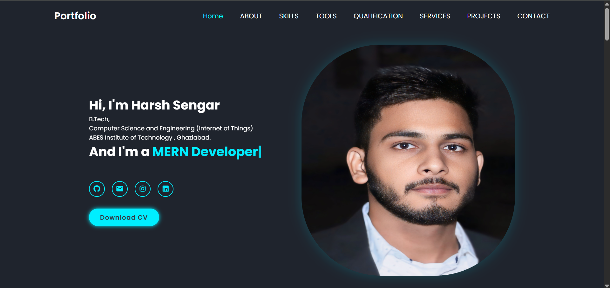

# 🚀Portfolio

Welcome to my **Portfolio Website**, a responsive and interactive platform to showcase my web development projects. Built with **HTML**, **CSS**, and **JavaScript**, it features smooth animations and dynamic content loading.

---

## 🖼️ Preview

## 🌐 Live Demo

**[View Live →](https://yourportfolio.com)**  

## ✨ Features

- 🎨 **Responsive Design** – Fully optimized for desktops, tablets, and mobile devices.
- 📦 **Dynamic Project Cards** – Projects are loaded from a JavaScript array, keeping the code modular and easy to maintain.
- 🎥 **CSS Animations** – Includes animated entry effects, image zoom-ins, hover transitions, and more.
- 🖱️ **Scroll-Based Reveal** – Content fades in as you scroll into view.
- ⚛️ **MERN & React Projects** – Highlights projects built with the MERN stack, React, APIs, and more.

---

## 📌 Technologies Used

- **HTML5**
- **CSS3**
- **JavaScript (ES6)**
- **Boxicons** for UI icons
- **Responsive Grid & Media Queries**

---

## 🙌 Contributing

This is a personal project, but feedback or pull requests are always welcome.

---

